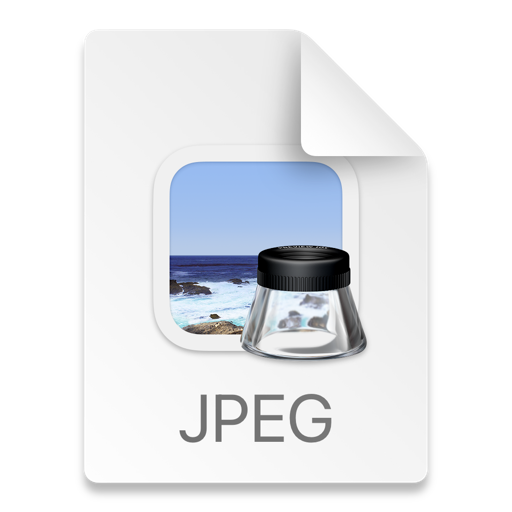

# Data Extraction and Validation Pipeline

_Please refer to individual packages for more information_

## 1. Accepting the Image
**Packages**: `receiveImage`

**Pre-condition**: `[fileName].jpg` or `[fileName].png` or `[fileName].jpeg` in `gpr_buffer` bucket

**Pre-condition**: `[uniqueFileName].jpg` or `[uniqueFileName].png` or `[uniqueFileName].jpeg` in `gpr_images` bucket

## 2. Processing the Image
**Packages**: `processImage`

**Pre-condition**: `[uniqueFileName].jpg` or `[uniqueFileName].png` or `[uniqueFileName].jpeg` in `gpr_images` bucket

**Post-condition**: `[uniqueFileName].csv` in `gpr_raw_data` bucket. `[uniqueFileName].csv` contains `Field Name` and `Field Value` columns.

## 3. Processing the Extracted Data
**Packages**: `dataAnalysis`, `processExtractedData`, `extractValue`

**Pre-condition**: `[uniqueFileName].csv` in `gpr_raw_data` bucket. `[uniqueFileName].csv` contains `Field Name` and `Field Value` columns.

**Post-condition**: `[fileName].json` in `gpr_sanitised_data` bucket.

# 4. Uploading to the Database
**Packages**: `databaseUpload`

**Pre-condition**: `[fileName].json` in `gpr_sanitised_data` bucket.

**Post-condition**: `[fileName].json` sent to database.